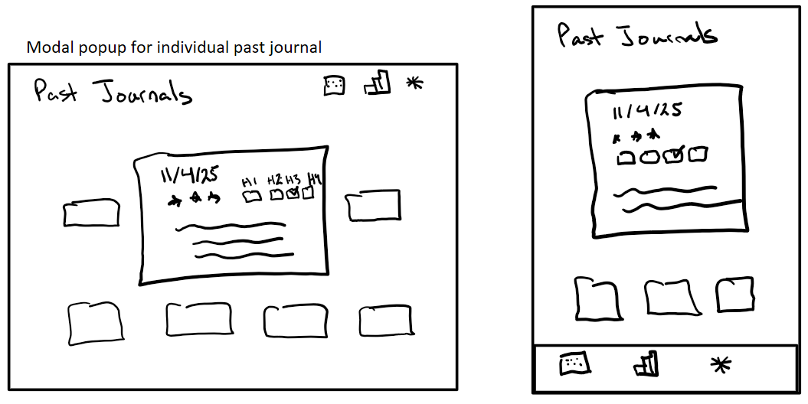
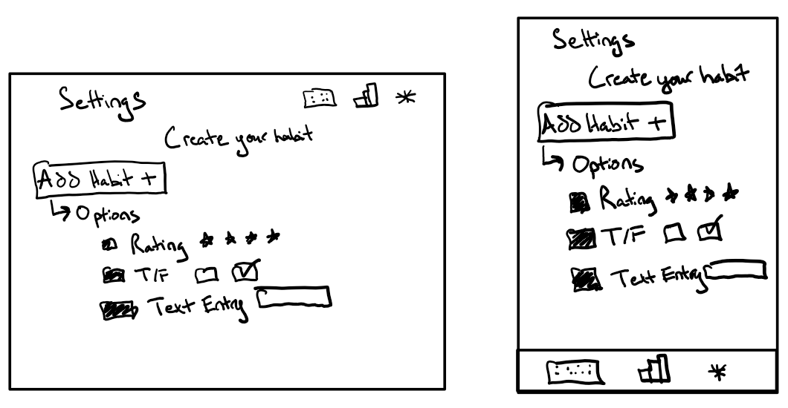

# Module 2 Group Assignment

CSCI 5117, Fall 2025, [assignment description](https://canvas.umn.edu/courses/518559/pages/project-2)

## App Info:

* Team Name: TODO
* App Name: TODO
* App Link: <https://TODO.com/>

### Students

* First Last, x500@umn.edu
* ...

## Key Features

**Describe the most challenging features you implemented
(one sentence per bullet, maximum 4 bullets):**

* ...

Which (if any) device integration(s) does your app support?

* ...

Which (if any) progressive web app feature(s) does your app support?

* ...

## Mockup images

**[Add images/photos that show your mockup](https://stackoverflow.com/questions/10189356/how-to-add-screenshot-to-readmes-in-github-repository) along with a very brief caption:**
Each mockup consists of the ideal view for a PC on the left next to the ideal view for a mobile device on the right. Our project is a habit tracker, where each day you can track habits such as your mood, a quick diary entry, and anything you're hoping to get done for the day. It allows you to view previous journal entries on an individual level and your previous journals at large by tracking stats about your mood or how often you've completed specific habits.

### Title Page
  
### Home Page
  
### View Previous Journals
  
### Popup Page
  
### Settings Page
  
### Stats Page
  

## Testing Notes

**Is there anything special we need to know in order to effectively test your app? (optional):**

* ...

## Screenshots of Site (complete)

**[Add a screenshot of each key page](https://stackoverflow.com/questions/10189356/how-to-add-screenshot-to-readmes-in-github-repository)
along with a very brief caption:**

## External Dependencies

**Document integrations with 3rd Party code or services here.
Please do not document required libraries (e.g., VUE, Firebase, vuefire).**

* Library or service name: description of use
* ...

**If there's anything else you would like to disclose about how your project
relied on external code, expertise, or anything else, please disclose that
here:**

...

npm install pug
npm install
npm install firebase@^9.23.0
npm install vuefire@next
npm install sweetalert2
